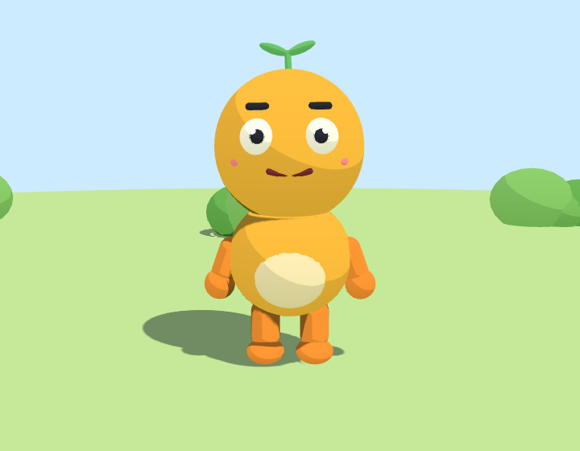

# aGame

Game cho trẻ em (đang thiết kế). Hiện tại repo chứa **nhân vật 3D "Bông"**: prototype chạy ngay trong trình duyệt, có đủ 7 trạng thái hoạt động và 14 biểu cảm, xuất được file GLB để dùng trong Unity / Godot / Blender.



## Chạy thử (1 lệnh)

```bash
python3 -m http.server 8765
# rồi mở: http://localhost:8765/character/
```

Không cần cài gì thêm: Three.js đã nằm sẵn trong `character/vendor/`.

| Phím | Hành động |
|---|---|
| `W A S D` / mũi tên | Đi |
| giữ `Shift` | Chạy |
| `Space` | Nhảy |
| `R` | Lăn |
| `C` | Trượt |
| `F` | Bật / tắt bay |
| chuột kéo / lăn | Xoay / zoom camera |

Bảng bên trái có nút cho từng hành động, từng biểu cảm, đổi màu, **Demo tự động** (nhân vật tự diễn hết mọi thứ) và **Xuất GLB**.

## Cấu trúc

```
character/
  index.html        giao diện + import map
  js/character.js   dựng mô hình từ khối cơ bản, đặt tên node, tư thế nghỉ
  js/face.js        14 biểu cảm = bộ tham số số học → áp lên node mặt
  js/poses.js       7 trạng thái (idle/walk/run/jump/roll/slide/fly) = hàm pose(nodes, t)
  js/app.js         scene, điều khiển, máy trạng thái, demo, UI
  js/export.js      bake pose → keyframe → GLB (kèm 21 animation clip)
  vendor/           three.module.js, OrbitControls.js, GLTFExporter.js (r170, MIT)
docs/
  CHARACTER_DESIGN.md   tài liệu thiết kế nhân vật (đọc cái này trước khi sửa)
  images/               ảnh render các trạng thái / biểu cảm
tools/
  screenshot.mjs        chụp ảnh tĩnh mọi trạng thái bằng Chromium headless
```

## Xem tiếp

→ [docs/CHARACTER_DESIGN.md](docs/CHARACTER_DESIGN.md)
