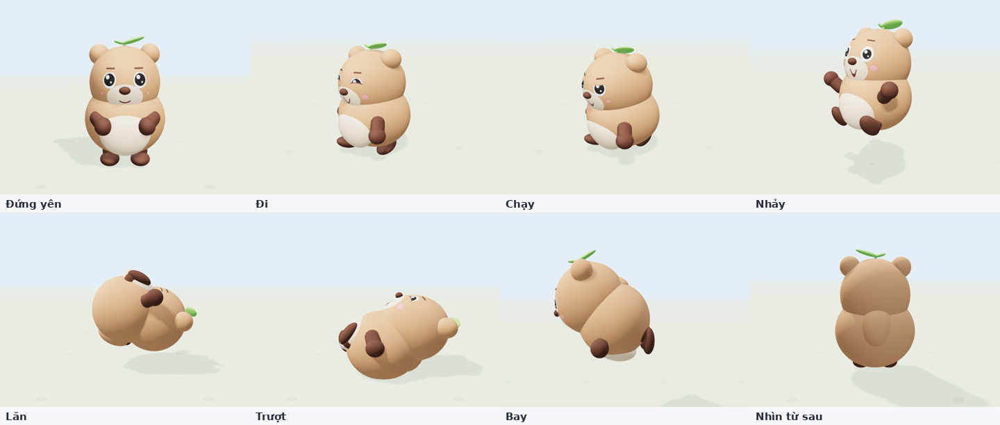
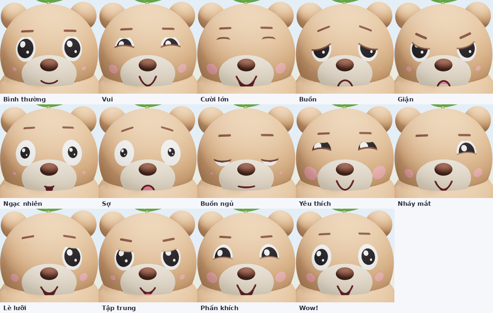

# Thiết kế nhân vật "Bông" (gấu béo)

> Tên tạm. Đổi tên ở `character/index.html` (tiêu đề) và `character/js/app.js` (tên file GLB xuất ra).

## 1. Ý tưởng

| | |
|---|---|
| **Đối tượng** | Trẻ em → hình khối tròn, màu ấm, mặt to, biểu cảm rõ |
| **Hình dáng** | Gấu béo: thân là MỘT khối tròn ú, đầu dính liền thân (không có khe cổ), tai tròn, mũi khối, đuôi ngắn đầu đậm, tay chân ngắn cục cục; tay nghỉ thì đặt lên bụng. Nguyên tắc: ít chi tiết, chi tiết nào có thì phải nhìn "xong" |
| **Điểm nhận dạng** | Một lá to + một lá nhỏ trên đỉnh đầu. Khi bay, lá xoay như cánh quạt |
| **Phong cách render** | "Clay render": vật liệu mờ (MeshStandard, roughness 0.9), ánh sáng môi trường mềm (RoomEnvironment), một nắng ấm + viền sáng lạnh từ sau, bóng VSM mịn, ACES tone mapping. Không toon, không viền |
| **Chiều cao** | ≈ 1.7 đơn vị (mét) tính cả lá; pivot `Root` ở mặt đất giữa 2 chân |
| **Hướng nhìn** | +Z (mặt nhìn về +Z, +Y lên trên, +X là bên trái nhân vật) |
| **Mặt** | Vẽ 2D kiểu Animal Crossing: mõm, mắt, mày, miệng, má vẽ thành texture dán sát đầu (`FacePlate`); chỉ mũi và tai là khối |



## 2. Bộ phận & tên node

Mọi bộ phận là `Object3D` có **tên duy nhất**. Tên này là "hợp đồng" giữa 3 file: `character.js` tạo, `poses.js` / `face.js` điều khiển, `export.js` bake ra GLB (track animation tham chiếu theo tên).

```
Root                      pivot mặt đất; squash & stretch, nhào lộn (roll), độ cao khi nhảy
└─ Hips                   (0, 0.45, 0) tâm xoay thân
   ├─ Body, Belly         khối thân + mảng bụng kem
   ├─ Tail                → TailMesh, TailTip
   ├─ LegL / LegR         pivot hông  → ShinL/R (capsule), FootL/R (bầu dục)
   ├─ ShoulderL / R       pivot vai (tư thế nghỉ = ôm bụng) → ArmL/R, HandL/R
   └─ Neck                (0, 0.45, 0) tâm gật / nghiêng đầu
      └─ Head             cầu r = 0.52, tâm ở y = 1.15, lún vào thân
         ├─ EarL / EarR   → EarMeshL/R, EarInnerL/R
         ├─ Nose
         ├─ FacePlate     chỏm cầu dán texture mặt 2D (mõm, mắt, mày, miệng, má)
         └─ Tuft          → Stem, Prop → LeafA, LeafB
```

Hậu tố `L` = bên trái nhân vật (+X), `R` = bên phải (-X).

Kích thước chính (file `character.js`, hàm `buildCharacter`):

| Bộ phận | Hình | Kích thước |
|---|---|---|
| Body | cầu scale | bán kính (0.60, 0.54, 0.54), tâm y = 0.62 |
| Head | cầu | r = 0.52, tâm y = 1.15 (lún vào thân ≈ 0.5) |
| Ear | cầu | r = 0.15 tại (±0.37, 0.40, −0.04) so với tâm đầu |
| FacePlate | chỏm cầu | r = 0.532, ngang −1.1…1.1 rad, dọc −0.7…0.9 rad quanh +Z |
| Mắt (vẽ) | elip | tâm (±0.40, 0.14) rad, bán trục 0.185 × 0.21 rad |
| Arm | capsule | r = 0.10, dài 0.12; Hand r = 0.12 |
| Shin | capsule | r = 0.11, dài 0.10; Foot (0.14, 0.09, 0.19) |
| Tail | cầu scale | (0.20, 0.28, 0.17), đầu đuôi r ≈ 0.10 màu đậm |

Bảng màu mặc định (`PALETTE` trong `character.js`): lông `#C9966F`, bụng / mõm / tai trong `#F1DCC2`, tay chân / mũi / sọc đuôi `#5E3A2E`, lá `#7CCB5A`, má `#F29AA6`, con ngươi `#1E1B22`, miệng `#6E2F34`.

## 3. Biểu cảm

Một biểu cảm = **1 bộ tham số số học** (`face.js`, `EXPRESSIONS`). `face2d.js` đọc bộ tham số này và vẽ mặt bằng Canvas 2D (1024×768) rồi dán lên `FacePlate`, chỏm cầu cách mặt đầu 1.2 cm. Toạ độ vẽ là góc trên mặt cầu (radian) nên hình không méo. Vùng mí mắt được xoá trong suốt để lộ đầu thật; tấm mặt không nhận bóng (bóng VSM sẽ in vệt lên vùng trong suốt).

| Tham số | Ý nghĩa | Dải |
|---|---|---|
| `brow` | góc lông mày: + giận (đầu trong hạ), − buồn (đầu trong nhướn) | −1 … 1 |
| `browUp` | nhướn mày | 0 … 0.1 |
| `lidTop` | mí trên nhắm bao nhiêu (âm nhẹ = trợn) | −0.15 … 1 |
| `lidBot` | mí dưới nâng bao nhiêu (≈ 0.5 là "mắt cười ^^") | 0 … 1 |
| `pupil` | cỡ con ngươi (nhỏ = sợ, to = yêu thích) | 0.4 … 1.5 |
| `curve` | độ cong miệng: + cười, − mếu | −1 … 1 |
| `open` | há miệng | 0 … 1 |
| `width` | bề rộng miệng | 0.5 … 1.3 |
| `blush` | má hồng | 0 … 1.5 |
| `wink` | nhắm riêng mắt phải | 0 … 1 |
| `tongue` | lè lưỡi | 0 … 1 |

Cơ chế vẽ:

- **Mí mắt** = 2 hình tròn lớn ép vào mắt từ trên và dưới. Mép trên cong "∪", mép dưới cong "∩" → nâng mí dưới là ra mắt cười; xoay theo `brow` để tạo mắt giận / buồn. Khi mí khép thì vẽ thêm nét mí mỏng.
- **Miệng** = đường bezier; `curve` bẻ cong, `open` tô khoang miệng và lưỡi, `tongue` lè lưỡi ra ngoài.
- **Chớp mắt** và **liếc theo camera** là lớp phủ lúc chạy thật (`app.js`), không nằm trong preset. Canvas chỉ vẽ lại khi tham số đổi.

14 biểu cảm có sẵn:



Mỗi trạng thái có biểu cảm mặc định (cột `face` trong `STATES`): đứng yên → bình thường, đi → vui, chạy → tập trung, nhảy / bay → wow, lăn → cười lớn, trượt → phấn khích. Người chơi / gameplay có thể ghi đè bằng `S.manualFace`.

## 4. Trạng thái hoạt động

`poses.js` — mỗi trạng thái là hàm thuần `pose(nodes, t)`, giả định khung đang ở tư thế nghỉ. Nhờ vậy cùng một hàm dùng cho cả chạy thật và bake.

| Trạng thái | Loại | Chu kỳ / thời lượng | Tốc độ | Ý chính của chuyển động |
|---|---|---|---|---|
| `idle` Đứng yên | lặp | 2.4 s | 0 | thở (squash 2%), đầu đung đưa, lá lắc |
| `walk` Đi | lặp | 0.455 s (2.2 bước/s) | 1.7 | chân ±37°, tay ngược chân, thân nhún 3.5 cm |
| `run` Chạy | lặp | 0.3 s (3.2 bước/s) | 4.5 | chân ±57°, thân ngả trước 17°, tay dang, nhún 7 cm |
| `jump` Nhảy | 1 lần | 1.0 s | giữ đà | 0–16%: thụp xuống (squash 0.78) → 16–84%: bay parabol cao 1.3, kéo dài 1.25 lúc bật, tay giơ, chân co → 84–100%: tiếp đất bẹp 0.75 |
| `roll` Lăn | 1 lần | 0.8 s | 4.5 → 2.7 | cuộn tròn (tay chân ôm), `Root` xoay 360° quanh trục X với tâm quay = tâm thân |
| `slide` Trượt | 1 lần | 1.0 s | 5.5 → 1.0 | ngả sau 43°, hạ hông, 1 chân duỗi trước, tay vung sau, lá bạt về sau |
| `fly` Bay | lặp | 1.25 s | 3.6 | thân nằm ngang (ngả trước 75°), tay dang vỗ nhẹ, lá xoay 40 rad/s, nhấp nhô 12 cm |

Quy tắc chuyển trạng thái (`app.js`):

- `idle / walk / run` quyết định mỗi frame từ input (có hướng → đi, giữ Shift → chạy).
- `jump / roll / slide` là **one-shot**: chạy hết thời lượng rồi quay về trạng thái liên tục; không ngắt được bằng one-shot khác.
- `fly` là toggle; đang bay thì không nhảy / lăn / trượt. Tắt bay → rơi xuống, chạm đất có squash tiếp đất.
- Mọi lần đổi trạng thái đều blend 0.22 s từ tư thế đang có (`capturePose` → `blendFromSnapshot`) nên không giật.
- Chuyển động ngang do `Mover` (nhóm bọc ngoài `Root`) đảm nhiệm → clip animation là *in-place*, engine tự di chuyển nhân vật.

Squash & stretch dùng `Root.scale = (1/√s, s, 1/√s)` để giữ "thể tích" → cảm giác dẻo, mềm.

## 5. Xuất sang engine

Nút **Xuất GLB** (hoặc `exportGLB()` trong `export.js`):

1. Với mỗi trạng thái: lấy mẫu pose 30 fps → `VectorKeyframeTrack` / `QuaternionKeyframeTrack` cho node nào có thay đổi.
2. Texture mặt (canvas) được nhúng PNG vào GLB.
3. `GLTFExporter` ghi `Root` + 7 clip ra `bong.glb`. `FacePlate` xuất kèm texture mặt đang hiển thị; biểu cảm trong engine làm bằng cách đổi texture (sprite sheet).

Lưu ý khi dùng:

- `Jump` có độ cao trong clip (`Root.position.y`); nếu engine dùng physics riêng thì xoá track đó hoặc dùng root-motion.
- `Roll` xoay `Root` 360°, tốc độ ngang do engine cấp.
- Hierarchy xuất ra là nhóm lồng nhau (không có skin / bone). Muốn rig xương chuẩn thì import GLB vào Blender, dùng cây node làm khung tham chiếu.

## 6. Mở rộng tiếp

| Muốn | Sửa ở |
|---|---|
| Thêm biểu cảm | `face.js` → thêm 1 dòng trong `EXPRESSIONS`; UI và demo tự nhận |
| Đổi nét vẽ mặt 2D | `face2d.js` → `drawFace` (vị trí, cỡ mắt, kiểu miệng…) |
| Thêm trạng thái (vd. bơi, ngồi) | `poses.js` → thêm vào `STATES` + hàm trong `POSES`; `app.js` thêm phím nếu cần |
| Đổi tỉ lệ / màu | `character.js` (`buildCharacter`, `PALETTE`) |
| Phụ kiện (mũ, kính) | thêm mesh con của `Head` trong `character.js`, đặt tên mới |
| Chụp lại ảnh tài liệu | `npm i playwright-core` rồi `node tools/screenshot.mjs docs/images` (cần server tĩnh ở cổng 8765) |

Tham số URL để xem tư thế tĩnh (dùng khi chỉnh số liệu): `index.html?state=jump&t=0.5&face=wow&cam=tq&lift=1&ui=0`
(`cam`: front / side / tq / face / back; `lift`: nâng camera).
